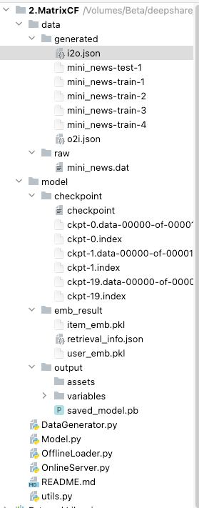

## 1.DataGenerator.py
    主类使用一个工具类CustomTFWriter，用于随机划分记录进入训练/测试集，控制单个文件记录数
    通过features配置更灵活的装配不同字段类型的数据
    运行时清空旧文件，保存映射字典到json

## 2.Model.py
    加入EarlyStopper，根据训练指标返回停止条件
    向量相似度计算方式采用余弦
    支持读取模型文件增量训练

## 3.OfflineLoader.py
    分离了一下不同准备对象的初始化过程
    保存embedding结果到pickle文件
    BallTree的建立和查询修改参数，redis同时存入召回分

## 4.OnlineServer.py
    微调实现过程

## 5.文件结构

    除data/raw中存放原始数据文件以外，其余不在根目录下的文件均在主流程执行过程中生成