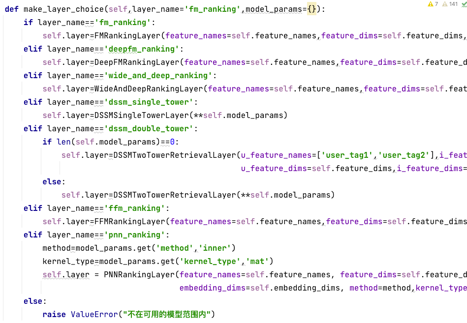

## 文件说明
### 1.DataGenerator.py

【输入】（1）用户、商品画像，样本记录的路径 （2）需要embedding建模的特征名称

【输出】 tf训练文件、
        记录原始特征值和embedding后label-encode结果的字典 feature_dict.json、
        用户画像字典{原始user_id:[各个特征embedding后的值列表]} user_profile.json、
        商品画像字典{原始item_id:[各个特征embedding后的值列表]} item_profile.json、
        特征维度信息字典,记录各个特征的取值类数，以及累计偏移量 data_info.json

【简述】 完成全部特征工程，并存储必要结果，使后续步骤和原始数据分离，避免重复处理数据
        数据划分新增根据时间戳为依据的选项
        特征处理前先进行了ipynb中的简要EDA

### 2.ModelManager.py

【输入】 数据处理结果文件的读取路径、要训练的模型类型、建模主要参数

【输出】 训练好的模型文件、checkpoint、tensorboard记录等

【简述】 负责建模及评估过程中的全部工作流。和模型实现分离，只调用自定义层并包装成Model类。通过输入训练模型的各个参数和训练要求，完成模型侧的所有工作

### 3.CustomLayers.py

实现ModelManager类中make_layer_choice方法中全部选项的layer:

 FMRankingLayer

 DeepFMRankingLayer

 DSSMSingleTowerLayer

 DSSMTwoTowerRetrievalLayer

 FFMRankingLayer

 PNNRankingLayer

 WideAndDeepRankingLayer(由于需要label-encode前的原始值,本次暂不可用)

 可以继续添加类并新增make_layer_choice中的选项，进而调用新模型

### 4.OfflineLoader.py

实现了存储u2i结果到redis的召回，以及离线存储item侧BallTree的生成存储
预测过程做了基于batch_generator批量预测的改进

### 5.OnlineServer.py

可以分别调用召回模型和排序模型分别完成推荐引擎算法侧的过程
召回可以读取redis中的u2i矩阵，也支持工业界中用户进入、读画像并生成embedding，查询item_embedding BallTree的双塔召回过程，user和item分离
可以根据项目中的召回结果排序，也可以输入自定义物品排序

### 6.Tools.py

EarlyStopper：新增better模式，即每次取得比上一次更好结果（而非历史最佳结果）时把累计次数置0

CustomTFWriter：无改动

# Tensorboard的结果记录

DSSM dual-tower model for retrieval

DeepFM model for ranking

