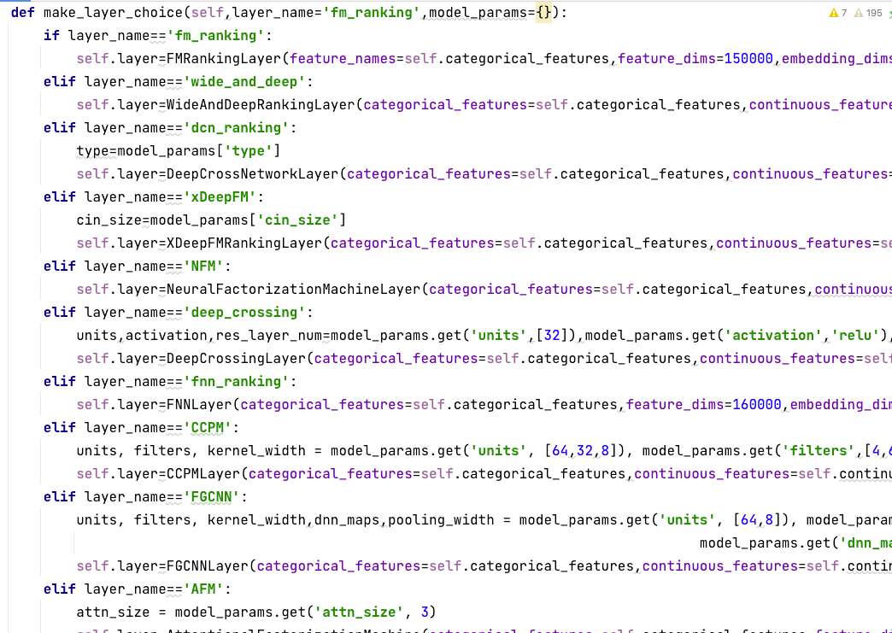

本次实现：
#### 1.WideAndDeepRankingLayer
Wide Deep
#### 2.DeepCrossNetworkLayer
DCN
#### 3.XDeepFMRankingLayer
xDeepFM
#### 4.NeuralFactorizationMachineLayer
NFM
#### 5.DeepCrossingLayer
DeepCrossing
#### 6.FNNLayer
FNN
#### 7.CCPMLayer
CCPM
#### 8.FGCNNLayer
FGCNN
#### 9.AttenionalFMLayer
AFM

选择层名称和是否接受连续性特征输入(FM,FNN,AFM须选择False)
mm = ModelManager(layer='AFM', allow_continuous=False)
mm.run()

